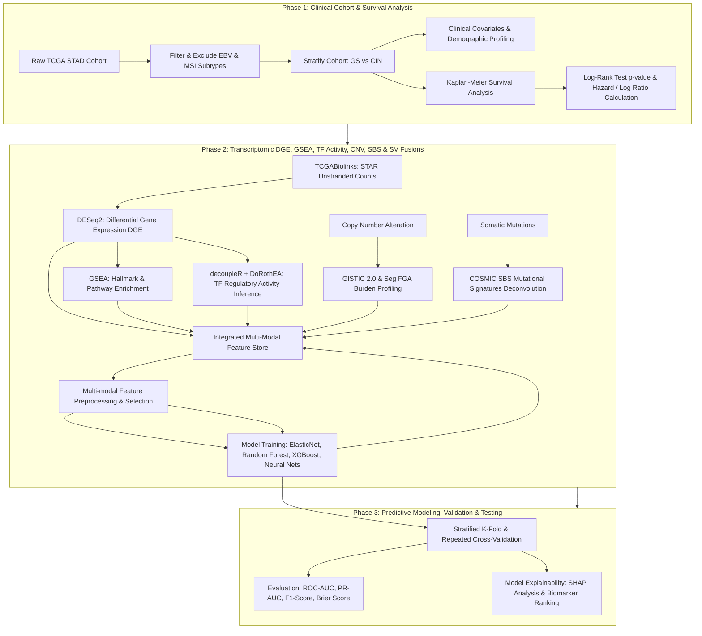

# Comparative Multi-Omics & Clinical Profiling: Genomically Stable (GS) vs. Chromosomal Instable (CIN) Gastric Cancer

[](#project-phases)
[-green.svg)](https://www.nature.com/articles/nature13480)
[](LICENSE)

---

## 🔬 Overview & Scientific Motivation

Gastric cancer (Stomach Adenocarcinoma, **STAD**) is a heterogeneous disease with distinct molecular subtypes characterized by landmark studies, notably The Cancer Genome Atlas (**TCGA**, Nature 2014). The TCGA classification defines four primary molecular subtypes:
1. **EBV** (Epstein–Barr virus-positive)
2. **MSI** (Microsatellite Instability)
3. **GS** (Genomically Stable)
4. **CIN** (Chromosomal Instability)

While **EBV** and **MSI** subtypes display distinct hypermutation phenotypes, high immunogenicity, and specific clinical trajectories, the majority of non-hypermutated gastric adenocarcinomas fall into either the **Genomically Stable (GS)** or **Chromosomal Instability (CIN)** classes:
- **Genomically Stable (GS)**: Enriched for diffuse histological variants, frequent *CDH1* and *RHOA* mutations, *CLDN18-ARHGAP* fusions, and low somatic copy-number alterations.
- **Chromosomal Instability (CIN)**: Characterized by marked aneuploidy, recurrent focal amplifications in receptor tyrosine kinases (e.g., *HER2/ERBB2*, *EGFR*, *MET*, *FGFR2*) and cell cycle regulators (e.g., *CCNE1*, *CCND1*, *CDK6*), and frequent *TP53* mutations.

This project focuses on a deep, comparative multi-omics and clinical investigation comparing **GS vs. CIN** subtypes, uncovering mechanistic drivers, survival disparities, transcriptomic networks, transcription factor regulatory activity, and training robust machine learning models to classify and distinguish these subtypes from multi-modal molecular features.

---

## 🗺️ Project Roadmap & Phased Implementation

The project is structured into three structured, sequential phases:



---

### 📌 Phase 1: Clinical Data Preprocessing & Survival Profiling
- **Cohort Curation**:
  - Ingest TCGA STAD clinical patient and sample metadata (`data_clinical_patient.txt`, `data_clinical_sample.txt`).
  - Filter out and drop samples belonging to **EBV** and **MSI** molecular subtypes.
  - Cohort validation: Retain strictly curated **GS** and **CIN** cohorts with high-confidence subtype annotations.
- **Baseline Clinical Comparison**:
  - Evaluate clinicopathological parameters (age, sex, AJCC tumor stage, TNM staging, Lauren classification: diffuse vs. intestinal, anatomic tumor location).
- **Survival Analysis**:
  - Kaplan–Meier survival curve estimation for Overall Survival (OS) and Disease-Free Survival (DFS).
  - Statistical hypothesis testing via **Log-Rank test** (deriving exact $p$-values).
  - Compute Hazard Ratios (HR) and Log-Hazard Ratios using univariate and multivariable **Cox Proportional Hazards Regression** adjusting for potential confounding covariates (e.g., stage, age).

---

### 📌 Phase 2: Multi-Omics Feature Extraction & Regulatory Signatures
- **mRNA Unstranded Counts Curation**:
  - Fetch TCGA-STAD STAR unstranded raw count matrices using `TCGABiolinks` / GDC API.
  - Align sample barcodes directly with curated GS ($N=58$) and CIN ($N=147$) clinical cohorts.
- **Transcriptomics (Differential Gene Expression - DESeq2)**:
  - Perform differential expression modeling using `pydeseq2` (DESeq2 negative binomial Wald testing).
  - Derive $log_2(\text{Fold Change})$, Wald statistics, raw $p$-values, and Benjamini-Hochberg adjusted $p$-values ($padj / FDR$).
- **Pathway & Gene Set Enrichment Analysis (GSEA)**:
  - Perform pre-ranked GSEA (`gseapy.prerank`) against MSigDB Hallmark gene sets to pinpoint dysregulated transcriptional pathways.
- **Transcription Factor (TF) Regulatory Activity Scores**:
  - Leverage **`decoupleR`** coupled with human **`DoRothEA`** regulon database (confidence levels A, B, C).
  - Infer per-sample transcription factor activity scores to capture upstream master regulator switches distinguishing GS from CIN.
- **Copy Number Alterations (CNV / CNA)**:
  - Calculate Fraction Genome Altered (FGA) burden per sample from segmented copy ratio data (`data_cna_hg19.seg`).
  - Profile high-level amplifications ($+2$) and homozygous deletions ($-2$) across key driver genes (*ERBB2*, *CCNE1*, *CDK6*, *EGFR*, *MET*, *FGFR2*, *MYC*, *KRAS*, *TP53*, *CDKN2A*).
- **Somatic Mutational Signatures (COSMIC SBS)**:
  - Extract 96-trinucleotide substitution context spectrums from $130,050$ somatic SNPs (`data_mutations.txt`).
  - Deconvolve COSMIC SBS signature relative activity exposures (SBS1: Aging, SBS3: HRD, SBS5: Clock-like, SBS17a/b: Gastric/5-FU, SBS2/13: APOBEC) via Non-negative Matrix Factorization (NMF).
- **Structural Variants & Gene Fusions (SV)**:
  - Profile hallmark structural rearrangements (`data_sv.txt`), including **`CLDN18` fusions** (hallmark GS driver), **`MYLK` fusions** (CIN enriched), and **`CDKN2A` silencing**.
- **Integrated Feature Store**:
  - Concatenate transcriptomic statistics, GSEA pathways, TF activity scores, CNV FGA, COSMIC SBS signature exposures, and SV binary indicators into `results/phase2_integrated_feature_store.csv` ($190 \text{ samples} \times 309 \text{ features}$) for Phase 3.

---

### 📌 Phase 3: Model Architecture, Training, Benchmarking & Testing
- **Predictive Modeling**:
  - Build machine learning classifiers to accurately separate GS from CIN tumors using single-omics and integrated multi-omics features.
  - Algorithms: Regularized Logistic Regression / ElasticNet, Random Forest, XGBoost / LightGBM, and Support Vector Machines (SVM).
- **Validation Strategy**:
  - Stratified $K$-Fold cross-validation and repeated nested CV to prevent data leakage and overfitting.
- **Performance Benchmarks**:
  - Evaluate via Receiver Operating Characteristic (ROC-AUC), Precision-Recall Curve (PR-AUC), Balanced Accuracy, Sensitivity, Specificity, and F1-score.
- **Interpretability & Biomarker Prioritization**:
  - Global and local feature attribution using **SHAP (SHapley Additive exPlanations)** values.
  - Identify key multi-omics driver genes, regulatory TFs, and genomic hallmarks that define the distinct biology of GS vs. CIN gastric cancer.

---

## 📂 Repository Structure

```text
GS_vs_CIN/
├── README.md                           # Project documentation and roadmap
├── .gitignore                          # Git ignore rules for data and artifacts
├── data/                               # Data directory (TCGA datasets & unstranded counts)
│   └── stad_tcga_pub/                  # TCGA STAD Nature 2014 dataset
├── notebooks/                          # Interactive Jupyter analysis notebooks
│   ├── 01_phase1_clinical_survival.ipynb
│   ├── 02_phase2_multiomics_features.ipynb
│   └── 03_phase3_modeling_evaluation.ipynb
├── src/                                # Modular source code (Python / R)
│   ├── __init__.py
│   ├── clinical/                       # Clinical curation & survival modeling
│   ├── omics/                          # TCGABiolinks count downloader, DESeq2 DGE & GSEA
│   ├── tf_inference/                   # DecoupleR & DoRothEA TF activity score inference
│   ├── models/                         # ML architectures, cross-validation & evaluation
│   └── utils/                          # Common helpers, I/O and plotting utilities
├── results/                            # Generated DEG tables, TF scores, GSEA results
└── figures/                            # Publication-quality figures & diagrams
```

---

## ⚙️ Tech Stack & Dependencies

- **Language & Environment**: Python 3.10+, R 4.x (optional for specialized Bioconductor packages)
- **Survival Analysis**: `lifelines`, `scikit-survival`, `statsmodels`
- **Transcriptomics & TF Inference**: `decoupleR`, `pydeseq2`, `scanpy` / `anndata`, `biomart`
- **Machine Learning & Evaluation**: `scikit-learn`, `xgboost`, `lightgbm`, `optuna`
- **Explainability**: `shap`, `lime`
- **Data Wrangling & Visualization**: `pandas`, `numpy`, `scipy`, `matplotlib`, `seaborn`, `plotly`

---

## 📜 References & Acknowledgements

1. **TCGA STAD Publication**: The Cancer Genome Atlas Research Network. *Comprehensive molecular characterization of gastric adenocarcinoma.* Nature **513**, 202–209 (2014). [doi:10.1038/nature13480](https://doi.org/10.1038/nature13480).
2. **DoRothEA Regulons**: Garcia-Alonso, L. et al. *Benchmark and integration of resources for the estimation of human transcription factor activities.* Genome Research **29**, 1363–1375 (2019).
3. **DecoupleR**: Badia-i-Mompel, P. et al. *decoupleR: ensemble of methods to infer biological activities from omics data.* Bioinformatics Advances **2**, vbac016 (2022).
4. **COSMIC Mutational Signatures**: Alexandrov, L. B. et al. *Signatures of mutational processes in human cancer.* Nature **500**, 415–421 (2013).
